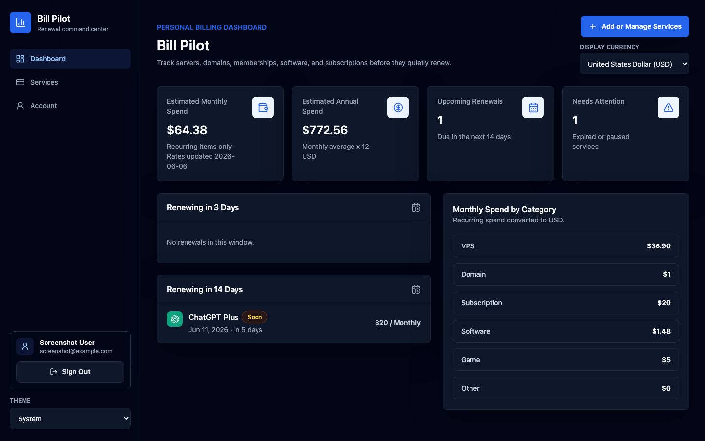

# Bill Pilot

[](./README.md)
[](./README.zh-CN.md)

Bill Pilot 是一个自托管账单与续费管理面板，用来管理服务器、域名、软件会员、游戏服务器和各种周期性订阅费用。

它适合部署在你自己的 Linux 服务器上，包括 VPS、VDS、独立服务器和家用服务器，并通过域名和 HTTPS 访问。



## 功能

- Dashboard 显示预计月支出和年支出
- 显示 3 天内和 14 天内即将续费的服务
- 服务列表支持搜索、筛选、排序和响应式视图
- 支持添加、编辑、删除周期性服务
- 支持浅色、深色和跟随系统主题
- 支持统一显示币种，并缓存汇率
- 内置常用服务图标，也支持上传自定义图标
- 邮箱/密码账号系统，Dashboard、Services 和 Account 页面受保护

## 服务器一键安装

把域名解析到一台全新的 Debian/Ubuntu 服务器后运行：

```bash
curl -fsSL https://raw.githubusercontent.com/TzeY11/bill-pilot/main/scripts/install-vps.sh -o install-vps.sh
sudo bash install-vps.sh
```

安装脚本会提示你输入域名。运行脚本之前，需要先在 Cloudflare、域名注册商或你的 DNS 服务商后台添加一条指向服务器 IP 的 DNS `A` 记录。

安装脚本会自动：

- 安装系统依赖，并在需要时安装 Node.js 22
- 把 Bill Pilot 克隆到 `/opt/bill-pilot`
- 生成 `.env` 和强随机 `AUTH_SECRET`
- 构建应用
- 创建 systemd 服务
- 配置 Caddy 和 HTTPS

查看安装脚本选项：

```bash
curl -fsSL https://raw.githubusercontent.com/TzeY11/bill-pilot/main/scripts/install-vps.sh -o install-vps.sh
sudo bash install-vps.sh --help
```

完整部署文档：[docs/deployment-vps.zh-CN.md](./docs/deployment-vps.zh-CN.md)

## 数据

用户账号和服务/订阅记录都存储在 SQLite：

```txt
data/bill-pilot.db
```

如果你从旧的 localStorage 版本升级，Bill Pilot 会在账号首次打开应用时，把浏览器里的旧服务数据导入 SQLite。

备份 `data/bill-pilot.db` 即可保护账号和服务记录。

## 备份

如果你使用一键安装脚本部署在 Linux 服务器上，运行：

```bash
sudo bash /opt/bill-pilot/scripts/backup-db.sh
```

备份脚本会把数据库备份保存到 `/opt/bill-pilot/backups`，默认删除 30 天以前的旧备份。

## 配置

复制 `.env.example` 到 `.env`，并设置：

```env
AUTH_SECRET="replace-with-a-random-secret-at-least-32-characters"
DATABASE_FILE="data/bill-pilot.db"
```

`AUTH_SECRET` 必须至少 32 个字符。

## 文档

- [服务器部署](./docs/deployment-vps.zh-CN.md)
- [一键安装脚本](./scripts/install-vps.sh)
- [备份脚本](./scripts/backup-db.sh)

## License

MIT

## 技术栈

- Next.js App Router
- TypeScript
- Tailwind CSS
- SQLite via Node's native `node:sqlite`
- bcryptjs
- jose
- react-icons / Simple Icons
